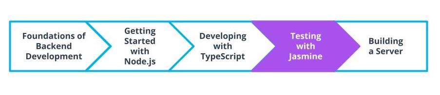

Lesson Recap
In This Lesson We Learned:
What TypeScript is and why it's used
How to get started with TypeScript and setup a project
Basic types with TypeScript
Object-like types and Classes
Understanding Type Definitions and working with Third Party Modules
Best Practices with TypeScript
Up Next

Next up, we'll look at how we can use Jasmine and test driven development to write unit tests for our applications.

See 24 - ND0067 FSJS C01 L02 A13 Lesson Recap V1

### Glossary

New Terms
Term	Definition
Access Modifier	Used in classes to declare how a property or method can be accessed from the application
Compile	Convert code from one language to another language with a different level of abstraction. Ex. Java to Machine Code
Duck typing	A programming paradigm where if two or more structures (functions, interfaces, objects) have the same properties, they can be used interchangeably regardless of any type declarations
Enumerated type	A set of constants that are automatically indexed and can be called by their name or index
Explicit Typing	When type is declared by the developer
Generic	A generic is a way to write a function that is reusable across different types
Implicit Typing	When type is Inferred by the compiler
Interface	Used as a blueprint to declare the shape of something reuseable such as functions, objects, and classes
lodash	A popular library for performing utility functions for things like arrays and numbers
Self-contained application	The use of self-contained implies the application receives data from no external sources
Strong-Typed	Types are important and require declarations. Steps need to be taken to change variables to different types
Transpile	Convert a language to a similarly abstracted language. Ex. ES6 to ES5
Tuple	A data type of an array with a set number of values where all value types are known
Weak-Typed	Types aren't declared and in some cases mixed and concatenated