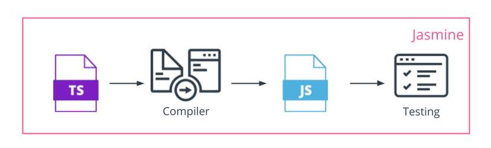

Installing Jasmine And Setting Up the Testing File Structure for Testing

See 5 - ND0067 FSJS C01 L03 A05 Configuring Jasmine Part 1 V2

Install Jasmine:
To install Jasmine run:
$ npm i jasmine 
Add a reporter for outputting Jasmine results to the terminal:
$ npm i jasmine-spec-reporter
Add type definitions for Jasmine with :
npm i --save-dev @types/jasmine
Add Testing Scripts:
Find the scripts object in the package.json and add the following to run jasmine:
“jasmine”: “jasmine”
Add a second script to both build your typescript and then run jasmine on the compiled JavaScript
"test" : "npm run build && npm run jasmine"
Set Up the File Structure:
In the main directory, create a folder named spec.
In the spec folder, create a folder named support.
In the support folder, create a file namedjasmine.json to hold the primary configurations for Jasmine.
In the src folder, add a folder named tests.
In tests add a file named indexSpec.ts to hold the tests for code in the index.js file.
In the tests folder, add another folder named helpers.
In helpers, add a file named reporter.ts. This will be the primary configuration for your spec reporter.
Best Practices For File Naming

When creating files for tests, a best practice is to name the .ts file the same as the .js file to be tested with Specappended to the end. The more tests needed to be run, the more test files will need to be created. Be sure to follow this best practice to keep track of the test file that contains the tests for each .js file.

#### Configuring Jasmine
See 6 - ND0067 FSJS C01 L03 A05 Configuring Jasmine Part 2 V2
In reporter.ts, add the following code from the jasmine-spec-reporter documentation on npm to configure the reporter to display Jasmine results to your terminal application. These are default settings and can be adjusted to meet your specific needs. The documentation on GitHub provides more options available.

import {DisplayProcessor, SpecReporter, StacktraceOption} from "jasmine-spec-reporter";
import SuiteInfo = jasmine.SuiteInfo;

class CustomProcessor extends DisplayProcessor {
    public displayJasmineStarted(info: SuiteInfo, log: string): string {
        return `${log}`;
    }
}

jasmine.getEnv().clearReporters();
jasmine.getEnv().addReporter(new SpecReporter({
    spec: {
        displayStacktrace: StacktraceOption.NONE
    },
    customProcessors: [CustomProcessor],
}));
In the jasmine.json add the following configurations for a basic Jasmine configuation:

{
    "spec_dir": "dist/tests",
    "spec_files": [
        "**/*[sS]pec.js"
    ],
    "helpers": [
        "helpers/**/*.js"
    ],
    "stopSpecOnExpectationFailure": false,
    "random": false
}
Write a Basic Test
Write a simple test to ensure that Jasmine is working as expected.

const myFunc = (num) => {
    return num * num;
};
it('expect myFunc(5) to equal 25', () => {
    expect(myFunc(5)).toEqual(25);
});

Troubleshooting
It is not uncommon for conflicts to arise between NPM packages as authors update or add functionality or as the packages that these packages depend on are updated.

When you get an error, you can either look for the error to see if it has been reported and follow a solution offered, use older stable versions, or attempt to remedy the issue and submitting a solution.

Example:
Shortly after this course was released, an update to jasmine-spec-reporter caused the code shown in the demo to break. The issue was resolved within a few weeks, but while it was being fixed, students needed to use a workaround.

You can read about the issue and the resolution here: https://github.com/bcaudan/jasmine-spec-reporter/issues/588

