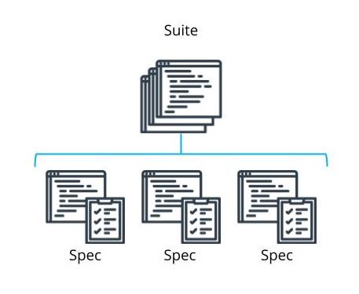

Writing Basic Unit Tests with Jasmine

See 7 - ND0067 FSJS C01 L03 A06 Writing Unit Tests Part 1 V2

Suites and Specs
Spec: an individual test
Suite: a collection of similar tests related to one function
Tests should cover all intended behaviors.
Error handling should also be tested

Jasmine Syntax
Use the describe keyword followed by a short description of what the suite is testing and one or more specs.
A best practice is to start a sentence with “it” and then complete the sentence with the description of what the suite is testing.
describe(“suite description”, () => {
    it(“describes the spec”, () => {
        const myVar = true;
        expect(myVar).toBe(true);
    });
}); 
Comparisons
Can compare strings, numbers, objects, or arrays
.toEqual(expected value)checks if the tested object is the same object

See 8 - ND0067 FSJS C01 L03 A06 Writing Unit Tests Part 2 V1

Test Types
Truthiness
.toBeTruthy()passes when
The expectation has any non-zero value
The expectation evaluates to true
.toBeFalsy()passes when the value is:
0
'' (an empty string)
undefined
null
NaN
If you just need the Boolean value of false, use .toEqual()
Numerical Matchers
.toBeCloseTo(expected value, precision)
Passes if a value is within a specified precision of the expected value
Precision is optional and is represented the number of decimal points to check (defaults to 2)
.toBeGreaterThan(expected value)
.toBeLessThan(expected value)
.toBeGreaterThanOrEqual(expected value)
.toBeLessThanOrEqual(expected value)
Negating Other Matchers
In JavaScript, use the ! to negate
In TypeScript, use not
In Jasmine, use .not
Exceptions
.toThrow(expected value)
.toThrowError(expected value, expected message) (expected value and expected message are optional)
Other Matchers
.toContain(expected value)
.toMatch(expected value)
.toBeDefined()
.toBeUndefined()
.toBeNull()
.toBeNan()
Custom matchers
New Terms
Term	Definition
Comparison Test	A type of test that compares strings, numbers, objects, or arrays
Numerical Matchers Test	A test of numerical values within a specified range of the expected value
Spec	An individual test
Suite	A group of related tests
Truthiness	When a conditional proves to be truth-like such as the boolean true or a condition being true, or a value not equal to 0, NaN, undefined, null, or empty.
Further Reading
Check out Jasmine's full documentation for working with matches.

Links 
- [x] https://jasmine.github.io/api/3.6/matchers.html