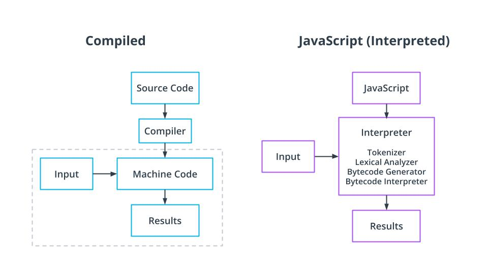

JavaScript Is Single threaded, Is Node.js?

See 18 - ND0067 FSJS C01 L01 A10 Is Node Js Single Threaded V1

Compiled vs. Interpreted Language
Compiled Language
Language is written and compiled to machine code inside of an application
Errors are detected during compiling
The code won’t compile until it’s error-free
Examples: C, C++, Erlang, Go
JavaScript is an Interpreted Language
Errors found when the code is run
The interpreter translates and runs code one statement at a time
Interpreted code runs more slowly

Node.js Is an Interpreter
Node.js is mostly written in C++
Many node modules also include some C++ code
Other modules include Python or C
C Libuv Library Gives Node.JS Access to a Thread Pool
Libuv takes advantage of the operating system's asynchronous interfaces before engaging the thread pool
The thread pool is engaged for events that require more processing power including compression and encryption tasks
The default thread pool includes four threads

New Terms
Term	Definition
Libuv	A library written in C that provides multithreading to Node.js and allows for heavy processing.
Further Reading
Learn about the misconceptions of the event loop and what Libuv actually does in this article by Daniel Khan: What you should know to really understand the Node.js Event Loop
As mentioned, Libuv accesses the computers async interfaces. The following provides information on those interfaces but has a high level of complexity, so know that the information exists if you decide you want to decipher or come back to it later.
See how Windows systems handle I/0: Synchronization and Overlapped Input and Output
See how Linux-based systems handle I/0: Linux Programmer's Manual: aio(7)

Links
- [x] https://medium.com/the-node-js-collection/what-you-should-know-to-really-understand-the-node-js-event-loop-and-its-metrics-c4907b19da4c
- [x] https://docs.microsoft.com/en-us/windows/win32/sync/synchronization-and-overlapped-input-and-output
- [x] https://man7.org/linux/man-pages/man7/aio.7.html