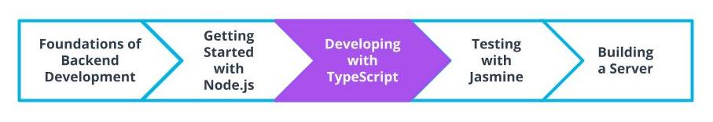

What We Have Learned
See 19 - ND0067 FSJS L01 A11 Lesson Recap V1

In this lesson we learned:
Why Node.js is used in millions of projects
How to get started with Node.js and run serverside JavaScript
What popular globals and APIs are made available to us through Node.js
How the event loop works in Node.js
Some of the best practices professionals follow for developing an application
Working with NPM to add dependencies to a Node.js project

Next up, we'll look at how we can use TypeScript to improve our application.

### Glossary

New Terms In This Lesson
Term	Definition
Container	A tool used to encapsulate the entirety of an application including runtime, libraries, and files to run independently of global configurations on an operating system
dependencies	Dependencies used in both development and production
devDependencies	Dependencies that are only necessary for development
Interpreted Language	The language is read by a runtime and executed on the spot and errors are found on execution
Libuv	A library written in C that provides multithreading to Node.js and allows for heavy processing.
Microservice	A piece of a larger application. In Microservice applications, the application is broken down into encapsulated microservices that can be maintained individually.
Monolithic Architecture	A unified architecture where there is no separation between services or components of the application.
Multithreaded language	The ability of a language to run 2 or more concurrent tasks on what are known as threads. A CPU has 2 threads. If you are on an 8 core machine, you could run 16 concurrent tasks.
Node Package Manager (npm)	A tool for managing project dependencies via command line as well as a website hosting more than 1 million third-party packages that can be used for your project
Node Version Manager (nvm)	A software package that allows a user to run a different version of Node.js for each project on the same machine
package-lock.json	A JSON file that contains all of the information for the dependencies of an app's installed modules
package.json	A JSON file that acts as a manifest for your project including name, author, version, description, license, dependencies, scripts, etc.
Prettier	A code formatting package that can be integrated into projects to improve code consistency and readability
REPL (Read, Evaluate, Print, Loop)	An environment used for running programming languages
Runtime	A runtime is an environment that is used to interpret and run a programming language.
Superset	A language that extends or builds on top of another language or standard.