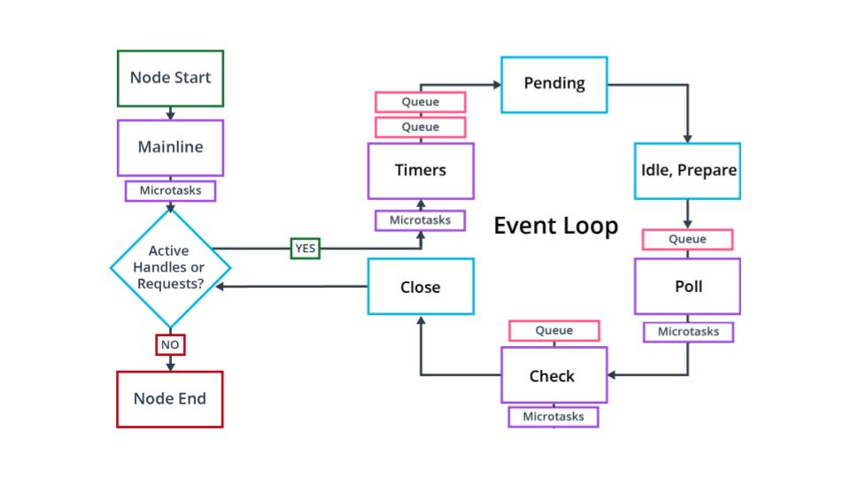

See
8 - ND0067 FSJS L01 A07 The Event Loop V1

Six Phases of The Event Loop
Timers - executes callbacks using timers. If there are timers set to 0 ms or setImmediate(), they will run here. Incomplete timers will run in later iterations of the loop.
Pending - internal phase
Idle/Prepare - internal phase
Poll - process I/O callbacks
Check - execute any setImediate() timers added in the Poll phase
Close - loop continues if there are more timers or I/O calls. If all timers and I/O calls are done, the loop closes and the process ends.
NOTE: process.nextTick(); will always run at the end of whichever phase is called and before the next phase.

A Bit More About the Polling Phase
The polling phase is a bit more complex than just adding to the poll queue. If there are no timers left to execute when the polling phase is reached, the poll phase will wait for input/output callbacks. If the I/O contains synchronous code, this code will not be added to the call stack till the polling phase is reached. If setImmediate() is reached, the polling phase will end and the check phase will begin. If setImmediate() is not called, the polling phase will continue to wait for a bit, and then move on through the next phases to execute additional timers and so forth.

Let's walk through a demonstration to help you visualize the loop. The code you see will be unfamiliar at this point, but by the end of this course, you'll fully understand it.

Demo: A Walk Through the Event Loop
The Event Loop can be intimidating. It helps to be able to see how it processes code. Let's look at a demonstration of the different phases of the loop that we have access to.

See
9 - ND0067 FSJS C01 L01 A08 Demo Event Loop Part 1 V2

Demo Code
const fs = require('fs');

// Mainline
console.log('Hello, ----------- mainline');
console.log('world. ----------- mainline');

// end mainline / pre timers phase 1
process.nextTick(() => {
  console.log('nexttick --------- before event loop');
});

// timers phase 1
setTimeout(() => {
  console.log('timeout - 0s ----- Timers 1');
}, 0);

// timers phase 1
setImmediate(() => {
  console.log('immediate -------- Timers 1');
});

// timers phase 1
setTimeout(() => {
  console.log('timeout - 0s ----- Timers 1');
}, 0);

// begin polling phase
fs.readFile(__filename, () => {
  // end poll phase
  process.nextTick(() => {
    console.log('nexttick i/o ----- After Polling');
  });
  // check phase
  setImmediate(() => {
    console.log('immediate i/o ---- Check');
  });
  // timers phase 2
  setTimeout(() => {
    console.log('timeout i/0 0s --- Timers 2');
  }, 0);
  // timers phase 3
  setTimeout(() => {
    console.log('timeout i/0 3s --- Timers 3');
  }, 3000);
});

// timers phase 4
setTimeout(() => {
  console.log('timeout - 5s ----- Timers 4');
}, 5000);

process.on('beforeExit', () => {
  console.log('process.on ------- beforeExit');
});
You can run this code in the workspace below. See the ordered.js file.

What If The Event Loop Out of Order?
One of the biggest perks of really taking advantage of the event loop, is we aren't left struggling to put our code in order. We can organize it by functionality because we have control over how our code gets processed. Let's look at the same code, completely out of order.

See 10 - ND0067 FSJS C01 L01 A08 Demo Event Loop Part 2 V1

Demo Code
const fs = require('fs');

// // blocking loop 2B
// for (let i = 0; i < 2000000000; i++) {
//   if (i === 1999999999) {
//     console.log('blocking loop');
//   }
// }

// timers phase 4
setTimeout(() => {
  console.log('timeout - 5s ----- Timers 4');
}, 5000);

// Mainline
console.log('Hello, ----------- mainline');

// timers phase 1
setTimeout(() => {
  console.log('timeout - 0s ----- Timers 1');
}, 0);

// Before Exit
process.on('beforeExit', () => {
  console.log('process.on ------- beforeExit');
});

// timers phase 1
setImmediate(() => {
  console.log('immediate -------- Timers 1');
});

// begin polling phase
fs.readFile(__filename, () => {
  // timers phase 3
  setTimeout(() => {
    console.log('timeout i/0 3s --- Timers 3');
    // blocking loop 3B
    for (let i = 0; i < 3000000000; i++) {
      if (i === 2999999999) {
        console.log('blocking loop');
      }
    }
  }, 3000);
  // check phase
  setImmediate(() => {
    console.log('immediate i/o ---- Check');
  });
  // timers phase 2
  setTimeout(() => {
    console.log('timeout i/0 0s --- Timers 2');
  }, 0);
  // end poll phase
  process.nextTick(() => {
    console.log('nexttick i/o ----- After Polling');
  });
});
// end mainline / pre timers phase 1
process.nextTick(() => {
  console.log('nexttick --------- before event loop');
});

console.log('world. ----------- mainline');

// timers phase 1
setTimeout(() => {
  console.log('timeout - 0s ----- Timers 1');
}, 0);

You can run this code in the workspace below. See the random.js file.

