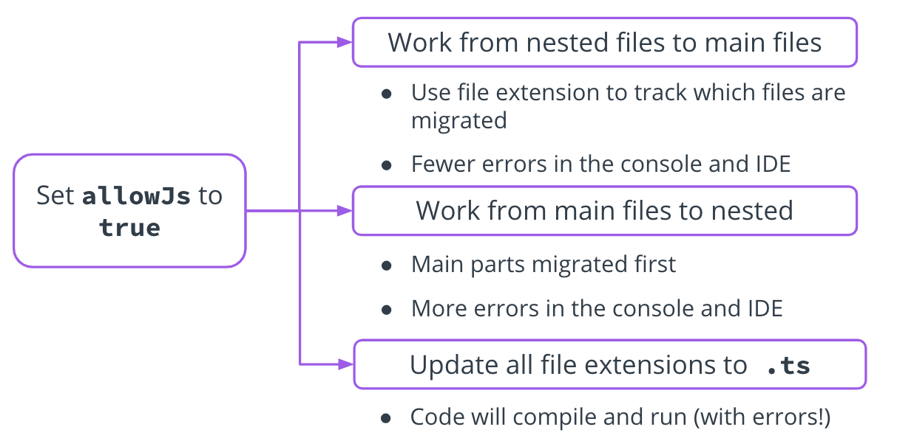

Adding TypeScript to an Existing Project

See 23 - ND0067 FSJS C01 L02 A11 Migrating To TypeScript V1

Migration Strategies
Look at the project structure
Decide whether to migrate all at once or file-by-file.
Add Typescript to each service if project uses microservice architecture.
For monolithic architecture, move to a src/dist to keep working files separate from complied Javascript.
Check if this affects any of the other paths within the project, as they might not be automatically updated (although most IDEs do).
If it doesn't automatically update, you can use a path module.
To exclude folders you don't want to be migrated, utilize the configuration file.
Third-party Module Type Definitions
To find the definitions, search through dependencies and dev-dependencies going through each dependency and adding definitions for each. If a dependency doesn't have definitions, you can create your own.

By setting allowJS to true in the config file, you. can follow the following approaches:

Work for nested files to main files
Use file extension to track which files are migrated
Fewer errors in the console and IDE
Work from main files to nested:
Main parts migrated first
More errors in console and IDE
Update all files to .ts
Code will compile, but run with errors.
Which Migration method do you think you would want to use on an already in-production application, and why would you choose that method?

Enter your response here, there's no right or wrong answer
Further Reading
A guide to the migration options for TypeScript from the JavaScript blog 2ality by Dr. Axel Rauschmayer: Strategies for Migrating to TypeScript.

Links 
- [x] https://2ality.com/2020/04/migrating-to-typescript.html