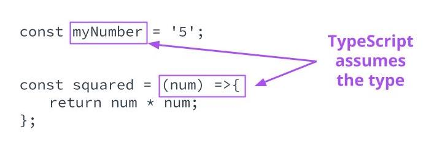

Implicit Typing and Explicit Typing
TypeScript offers two types of typing:

See
8 - ND0067 FSJS C01 L02 A04 TypeScript Basics Part 1 V2

Implicit Typing
TypeScript will automatically assume types of objects if the object is not typed. It is best practice to allow TypeScript to type immutable variables and simple functions implicitly.

const myNum = 3; // TypeScript implicitly types myNum as a number based on the variable
Implicit Typing is a best practice when the app is self-contained (meaning that it does not depend on other applications or APIs) or variables are immutable.

### Explicit Typing
The developer does explicit typing. The developer explicitly applies a type to the object.

let myVar: number = 3; // myVar has been explicitly typed as a number 

Basic Types
string - used for string types, textual data

let studentName:string;
studentName = 'Dae Lee'
number - used for number types including integers and decimals

let studentAge: number;
studentAge = 10;
boolean - used for true/false types

let studentEnriched: boolean;
studentEnriched = true;
Union Types - used when more than one type can be used

let studentPhone: (number | string);
studentPhone = '(555) 555 - 5555';
studentPhone = 5555555555;
null - used when an object or variable is intentionally null, typically only functionally found in union types

const getCapitals = (str:string):string[] | null => {
  const capitals = str.match(/[A-Z]/);
  return capitals;
}

console.log(getCapitals('something'));
// returns null
console.log(getCapitals('Something'));
// returns ['S']
undefined - used when a variable has yet to be defined

const myFunc = (student: string | undefined) => {
  if ( student === undefined ){
    // do something
  } 
};

### More Basic Types
Play Video
See 9 - ND0067 FSJS C01 L02 A04 TypeScript Basics Part 2

void - used as a return type when the function returns nothing

const myFunc = (student: string): void {
  console.log(student);
};
never - used as a return type when the function will never return anything, such as with functions that throw errors or infinite loops

const myError = (err: string): never {
  throw new Error(err); 
}
any - should be avoided. Used when the type of the item being typed can be anything

const myFunc = (student: any): any => {
  // do something
};
unknown - used when the type of the thing being typed is unknown. Used heavily for type assertion

const myFunc = (student: unknown): string => {
  // do something
}
Type Assertions
Type Assertions are used to tell TypeScript that even though TypeScript thinks it should be one type, it is actually a different type. Common to see when a type is unknown

const myFunc = (student: unknown): string => {
  newStudent = student as string;
  return newStudent;
}
typeof
If you run into a situation where you have an ambiguous function, and you don't know exactly what it's doing, or you're working with a third-party library, and type definitions are missing, and you quickly want to access the type, one way of doing so is using typeof. This won't work for every type, such as null returning an object, but it will work for most.

console.log(typeof myFunc(param));
Further Reading
Official documentation from Microsoft on TypeScripts basic types.

A cheat sheet for TypeScript, from SitePen, the founders of TF Conf, a conference for TypeScript.

New Terms
Term	Definition
Explicit Typing	When type is declared by the developer
Implicit Typing	When type is Inferred by the compiler
Self-contained application	The use of self-contained implies the application receives data from no external sources

Links 
- [x] https://www.typescriptlang.org/docs/handbook/basic-types.html
- [x] https://www.sitepen.com/blog/typescript-cheat-sheet