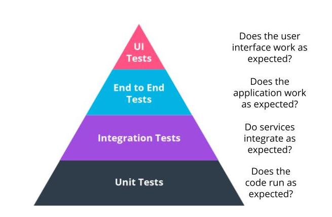

Jasmine Can Be Used for More Than Just Unit Testing

See 17 - ND0067 FSJS C01 L03 A10 Beyond Unit Testing V1

The Testing Pyramid
UI Testing: Does the user interface work as expected?
End to End Testing: Does the application work as expected?
Integration Testing: Do services integrate as expected?
Unit Testing: Does the code run as expected?

### Jasmine and Testing:

Jasmine works well with Unit Testing and Integration Testing. Remember, the difference between Unit Testing and Integration Testing is the use of third-party integration. An example would be function that creates an endpoint. This requires a Unit Test. However, if the use case requires testing of the response from the endpoint and requires a third-party tool to do so, this becomes an integration test.

Jasmine can be used for End-to-End Testing with a tool call Selenium to emulate user interactions.

For UI Testing, Jasmine is simply not helpful.

Links 
- [x] https://medium.com/@nathankpeck/microservice-testing-unit-tests-d795194fe14e