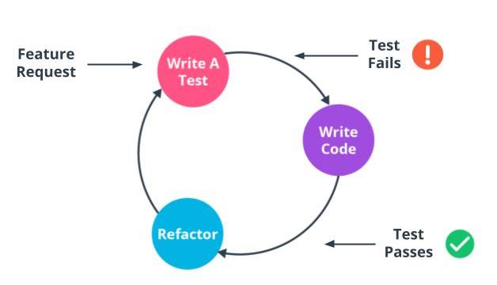

Testing Is Important!

See 2 - ND0067 FSJS C01 L03 A02 Why Testing V1

When developing, our goal is to develop in a way that if someone new reads our code the code is clear, concise, and bug-free. Debugging and refactoring are as important as writing the initial code. It's common for new developers to learn development in a way that you code and use tools like console.log as your method for debugging. However, there's a better way.

Introducing testing into your project as a priority and first action allows you to code in a way that writing concise and accurate code that takes into consideration edge cases right from the beginning when the code is easiest to correct. Running our tests is dependent on the developer and can be set to run when the project is saved, compiled, or on-demand. Tests are also incredibly helpful during deployment and can find conflicts between different developers' code, making sure that deployed code is error-free.

The majority of tests written for an application are unit tests. Unit tests test individual pieces of code.

### Behavior Driven Development
Jasmine is recognized as a Behavior Driven Development testing framework. This makes sense since Jasmine was originally developed for front-end development testing which focuses on user behavior. With Behavior-driven development, tests are focused on how the user interacts with the application, and stakeholders are included throughout the entire process. However, Jasmine can also be used on the backend where we are less concerned with the user's behavior.

Test-Driven Development
Test-Driven Development is a development style well suited for backend development. It focuses on writing unit and integration tests that produce expected results.

Test-driven development follows a development cycle:

A feature request comes in
Tests are written for the most simple functionality of the feature that includes edge cases and failure expectations
Tests fail due to lack of code
Code is written to make tests pass
Code is refactored to be most concise and easy to read
This cycle continues until the feature is complete. The tests remain in the codebase and as the feature is built upon or other features are added, the tests will ensure the feature continues to work as expected and will quickly alert the development team to any potential conflicts or bugs.

Further Reading
There are a lot of different styles of testing available that are useful across a team. Agile Alliance (an organization focused on agile project management) has produced a great resource general understanding of Test Driven Development not specific to any language or framework: What is Test Driven Development?

IBM provides a great deal of information on using Test Driven Development with JavaScript. Check out this article by Grant Steinfeld: 5 Steps of Test Driven Development.

Learn more about how Jasmine can be used as both a Behavior Driven Development framework as well as a Test-Driven Development framework from Testio: Is Jasmine BDD or TDD? Here’s What You Need to Know.

New Terms
Term	Definition
Behavior Driven Development	A development style built on Test Driven Development where the focus is user interaction and stakeholders.
Test-Driven Development	A development style where tests are written before development

Links
- [x] https://jasmine.github.io/
- [x] https://www.agilealliance.org/glossary/tdd/#q=~(infinite~false~filters~(postType~(~'page~'post~'aa_book~'aa_event_session~'aa_experience_report~'aa_glossary~'aa_research_paper~'aa_video)~tags~(~'tdd))~searchTerm~'~sort~false~sortDirection~'asc~page~1) 
- [x] https://developer.ibm.com/articles/5-steps-of-test-driven-development/
- [x] https://www.testim.io/blog/is-jasmine-bdd-or-tdd/