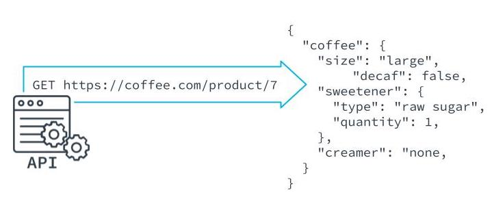

What Is an Endpoint and How Do We Test It?
See 12 - ND0067 FSJS C01 L03 A08 Endpoint Testing V2
#### Defining an Endpoint
An endpoint is the URL of the REST API with the method that gets, adds to, or modifies the data of an API in some way.

See 13 - ND0067 FSJS C01 L03 A09 Setup Teardown And 
Test Control V1

Benefits of Endpoint Testing
Confirms that the server is working.
Confirms that endpoints are configured properly.
More efficient than manual testing.
Adding a Framework for Endpoint Testing
Endpoint testing is not native to Jasmine and requires a third-party framework, like Supertest to test the status of responses from servers.

Setting Up Endpoint Testing
Install Supertest as a dependency.
$ npm i supertest
Add type definition to allow the code to compile without TypeScript errors.
$ npm i --save-dev @types/supertest. 
Import SuperTest in the spec file.
import supertest from 'supertest';
import app from '../index';

const request = supertest(app);
describe('Test endpoint responses', () => {
    it('gets the api endpoint', async (done) => {
        const response = await request.get('/api');
        expect(response.status).toBe(200);
        done();
    }
)});

Create and Run Tests
$ npm run test
New Terms
Term	Definition
Endpoint	An endpoint is the URL of the REST API with the method that gets, adds to, or modifies the data of an API in some way