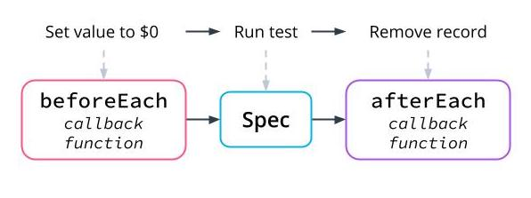
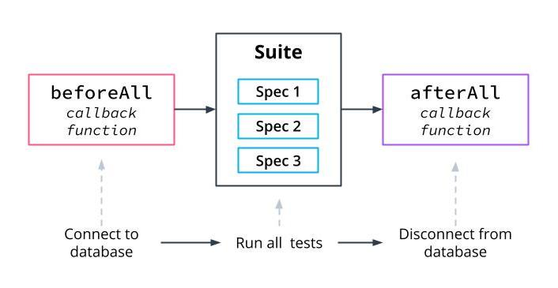
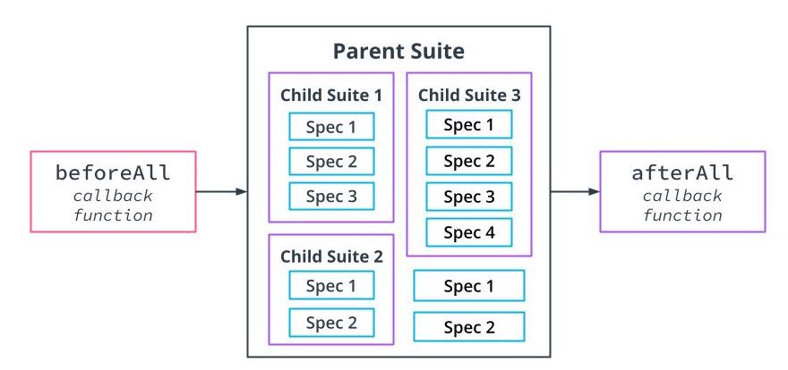

Performing Tasks Before and After Tests

See 14 - ND0067 FSJS C01 L03 A12 Demo 03 Setup Teardown Part 1 V2

Setup and Teardown of Suites
These Jasmine features allow you to

Connect to a database before a test
Connect to a different database for specific tests
Run only a specific test
Skip one or more tests
beforeEach and afterEach
beforeEach takes a callback function where we can tell the test to perform a task before each test is run.
afterEach is used if there is a task to be run after each test is complete.
Example:

describe("", () => {
  beforeEach(function() {
    foo = 1;
  });

  it("", () => {
    expect(foo).toEqual(1);
    foo += 1;
  });

  it("", () => {
    expect(foo).toEqual(2);
  });
});

beforeAll and afterAll
To perform an operation once before all the specs in a suite, use beforeAll
To perform an operation once after all the specs in a suite, use afterAll.

Handling More Than One Suite
Jasmine gives us the ability to use set up and teardown for more than just one suite. Whatever action is performed as setup or teardown for the parent suite, all sub-suites will also have access to the repeated or one-time setup or teardown.

Example:

describe("A spec", function() {
  beforeEach(function() {
    foo = 0;
  });

  it("is just a function, so it can contain any code", function() {
    expect(foo).toEqual(1);
  });

  describe("nested inside a second describe", function() {
    var bar;

    it("can reference both scopes as needed", function() {
      expect(foo).toEqual(bar);
    });
  });
});

Skipping or Specifying Tests
To skip a test or suite, add x in front of describe or it. This can be helpful to avoid a time-consuming test.
To focus on one test or suite, add f in front of describe or it. This reduces clutter in the terminal.
Example:

xdescribe("A spec", function() {
    it("is just a function, so it can contain any code", ()=> {
        expect(foo).toEqual(1);
    });
});

fdescribe("A spec", function() {
    it("is just a function, so it can contain any code", ()=> {
        expect(foo).toEqual(1);
    });
});

#### Set Up and Tear Down in Practice

In this demonstration, setup and teardown are used to organize the tests perform some functions to better run our tests.

Suites are set up to organize the tests with one parent suite and 2 child suites.
There are an object and an array providing data to be used within the child suites.
beforeAll();can be used to run some code before the specs run, and any log statements show up before the specs.

See 14 - ND0067 FSJS C01 L03 A12 Demo 03 Setup Teardown Part 1 V2

afterAll(); allows functionality to be added after all of the specs in a suite have run. Log statements will show after the specs.
beforeEach(); and afterEach(); will run before or after each one of the individual specs.
fdescribe and fit allows jasmine to focus on one specific suite, skipping the others
xdescribe and xit allows Jasmine to skip a specific suite or test, running all others.

See 15 - ND0067 FSJS C01 L03 A12 Demo 03 Setup Teardown Part 2 V1